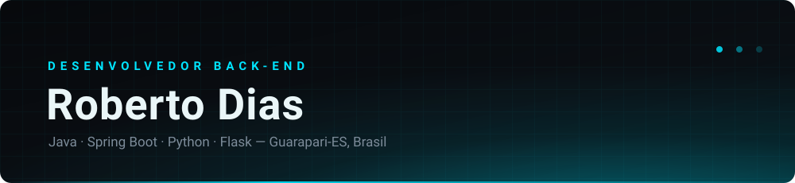
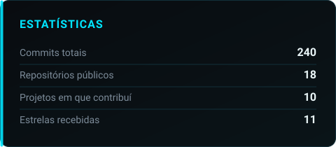
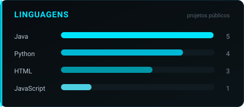

 

---

## Sobre mim

Estudante de **Sistemas de Informação** na Universidade de Vila Velha (UVV), no 5º período, morando em Guarapari-ES.

- Foco em **desenvolvimento back-end** com Java/Spring e Python/Flask
- Procurando uma **vaga de estágio** em desenvolvimento
- Também construo e mantenho as ferramentas digitais da **S.Dias Aromas**, negócio artesanal de aromas para casa
- Certificações Alura (Python, SQL, Git/GitHub, Linux, Lógica) e Oracle Java Fundamentals

> Aprendo construindo: cada repositório aqui é um projeto que saiu do papel.

---

## Tecnologias

**Linguagens**

**Frameworks e bibliotecas**

**Ferramentas e infraestrutura**

---

## Projetos em destaque

| Projeto | O que é | Stack |
| :--- | :--- | :--- |
| **[E-Ponto](https://github.com/underthedarkxx/E_Ponto)** | Ponto eletrônico web: batidas com geolocalização, banco de horas, relatórios legais (AFD/AEJ) e 2FA | `Python` `Flask` `SQLAlchemy` |
| **[S.Dias — Estoque e Vendas](https://github.com/underthedarkxx/Gerenciamento-de-estoque-e-vendas.)** | API REST de estoque, produção e vendas: ficha técnica, lotes de maceração e baixa de estoque atômica | `Java 21` `Spring Boot` `JPA` `MySQL` |
| **[Imperium](https://github.com/underthedarkxx/Imperium)** | API REST com Spring Security, JWT e JPA, acompanhada de frontend web | `Java 21` `Spring Boot` `JWT` |
| **[EngenhaTech](https://github.com/underthedarkxx/Engenhatec)** | Plataforma educacional feita em equipe: API Flask com autenticação JWT e área de assinantes | `Python` `Flask` `JWT` |
| **[Controle de Estoque](https://github.com/underthedarkxx/Sistema_de_Controle_de_Estoque)** | Java puro com POO e Swing: cadastro de produtos, vendas, relatórios e cálculo de lucro | `Java` `POO` |
| **[Portfólio](https://github.com/underthedarkxx/siteApresentacao)** | Meu site pessoal, publicado na Vercel | `HTML` `CSS` `Bootstrap` |

---

## Números

---

### Aberto a oportunidades de estágio em back-end

Guarapari-ES · Presencial, híbrido ou remoto

